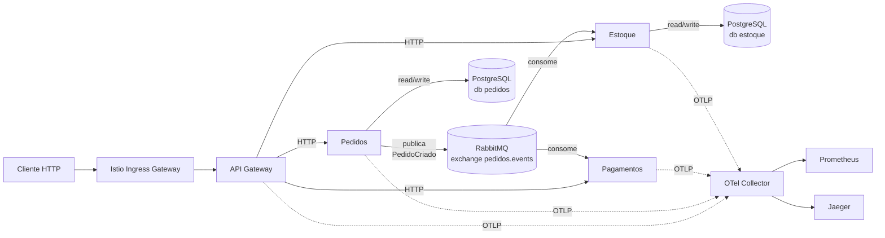
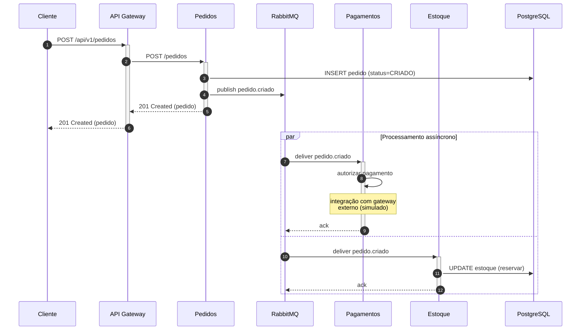

# Arquitetura — Pedidos Veloz

## 1. Visão geral

A plataforma é composta por **4 microsserviços** (Python/FastAPI), comunicando-se de forma síncrona (HTTP) e assíncrona (RabbitMQ), com **PostgreSQL** para persistência e **Istio** como service mesh em produção.



## 2. Fluxo de criação de pedido



**Por que mensageria?** Desacopla o caminho crítico de criação do pedido das integrações externas (autorização de pagamento) e da reserva de estoque. Se Pagamentos cair, a mensagem permanece na fila durável e será processada quando o consumer voltar — sem perder dados nem derrubar o gateway.

## 3. Estratégia de deploy — Canary em Pagamentos

```mermaid
flowchart LR
    VS["VirtualService<br/>pagamentos"] -->|95%| V1["Deployment<br/>pagamentos-v1<br/>(version=v1)"]
    VS -->|5%|  V2["Deployment<br/>pagamentos-v2<br/>(version=v2)"]
    V1 --> Pods1[Pods v1]
    V2 --> Pods2[Pods v2]
```

**Etapas:**

1. Deploy de `pagamentos-v2` com **0% de tráfego** (smoke test interno via header `x-canary: true`)
2. **95/5** — observar SLOs (latência p95, taxa de erro, traces) por 30 min
3. **75/25** — se métricas ok, expandir
4. **0/100** — promover v2; remover Deployment v1 após 24h de soak

**Rollback:** reverter pesos com 1 `kubectl apply` (estado no Git via Argo CD). Outlier detection do Istio também ejeta automaticamente pods doentes.

## 4. Estratégia de escalabilidade

| Serviço      | minReplicas | maxReplicas | Métrica            |
| ------------ | ----------- | ----------- | ------------------ |
| API Gateway  | 2           | 10          | CPU 70% + Mem 80%  |
| Pedidos      | 2           | 8           | CPU 70%            |
| Pagamentos   | 3           | 12          | CPU 70%            |
| Estoque      | 2           | 6           | CPU 70%            |

**Por que HPA e não VPA?** Os serviços são stateless e leves; é mais eficiente acrescentar réplicas durante o pico (que dura horas) do que aumentar tamanho de pod (requer restart e perda de capacidade momentânea). VPA fica como recomendação futura para Postgres (tunar `requests/limits` ao consumo real).

**PodDisruptionBudget:** garante `minAvailable` durante upgrades de nó ou drain (3 em Pagamentos, 1 nos demais).

## 5. Observabilidade — três pilares

| Pilar     | Tecnologia                      | Sinal típico                           |
| --------- | ------------------------------- | -------------------------------------- |
| Métricas  | Prometheus + Grafana            | RPS, latência p95, error rate (RED)    |
| Logs      | stdout JSON → Loki (prod)       | Eventos de negócio + erros estruturados|
| Traces    | OpenTelemetry → Jaeger          | Latência por span, dependency graph    |

Todos os serviços instrumentam:

- `prometheus-fastapi-instrumentator` → `/metrics`
- `opentelemetry-instrumentation-fastapi` → spans HTTP automáticos
- `opentelemetry-instrumentation-httpx` → propagação de trace context entre serviços

## 6. Segurança — camadas

1. **Imagem:** multi-stage, base `python:3.12-slim`, usuário `app:10001` não-root, `readOnlyRootFilesystem: true`, `capabilities: drop ALL`
2. **Namespace:** Pod Security Admission `restricted`
3. **Rede:** NetworkPolicy `default-deny` + allows explícitos por par origem→destino
4. **Mesh:** Istio `PeerAuthentication: STRICT` (mTLS obrigatório) + `AuthorizationPolicy` por ServiceAccount
5. **Secrets:** Kubernetes Secret (dev) → External Secrets Operator + AWS Secrets Manager (prod)
6. **Supply chain:** Trivy scan no CI, imagens assinadas (cosign — próximo passo), tags imutáveis por SHA

## 7. Decisões e trade-offs

| Decisão                                  | Por quê                                                      | Trade-off                                                  |
| ---------------------------------------- | ------------------------------------------------------------ | ---------------------------------------------------------- |
| Python + FastAPI                         | Produtividade alta, OpenAPI nativo, async, OTel oficial      | Throughput menor que Go/Rust; mitigado por escala horizontal |
| 1 Postgres com schema por serviço        | Custo operacional baixo no MVP                               | Não é true database-per-service; refatorar em scaling      |
| RabbitMQ em vez de Kafka                 | Footprint menor, suficiente para o volume; routing topic     | Throughput < Kafka; revisar se escalar para milhões de eventos/dia |
| Istio em vez de Linkerd                  | Mais funcionalidades (canary nativo, AuthZ rica)             | Curva de aprendizado e overhead maiores                    |
| GitHub Actions em vez de GitLab CI       | Integração nativa com GHCR e OIDC pra AWS                    | Lock-in moderado no GitHub                                 |
| Minikube/Kind em dev                     | Idêntico semanticamente a EKS/GKE                            | Sem suporte a alguns recursos cloud-specific (IRSA, ALB)   |
| Rolling como default + Canary para Pagamentos | Combinação balanceada de risco vs custo operacional          | Canary requer Istio configurado e métricas confiáveis       |
